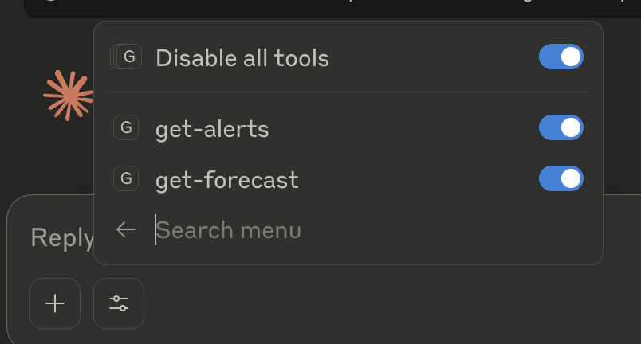

# Claude MCP Server Study

This is a quick app which was studying Claude MCP server.

## How to use the commands

```bash
# There are 2 commands get-alerts & get-forecast
# - get-alerts
# - get-forecast

# we can install these 2 commands within claude desktop app
# Go to your project folder run comamnd:
npm run build
# Then go to claude desktop app project folder:
cd /Users/damonwu/Library/Application Support/Claude
touch claude_desktop_config.json
# And Then put these configurations inside the claude_desktop_config.json file:
{
  "mcpServers": {
    "weather": {
      "command": "node",
      "args": ["/ABSOLUTE/PATH/TO/PARENT/FOLDER/weather/build/index.js"]
    }
  }
}
# Finally, you will see 2 commands under here:
```


